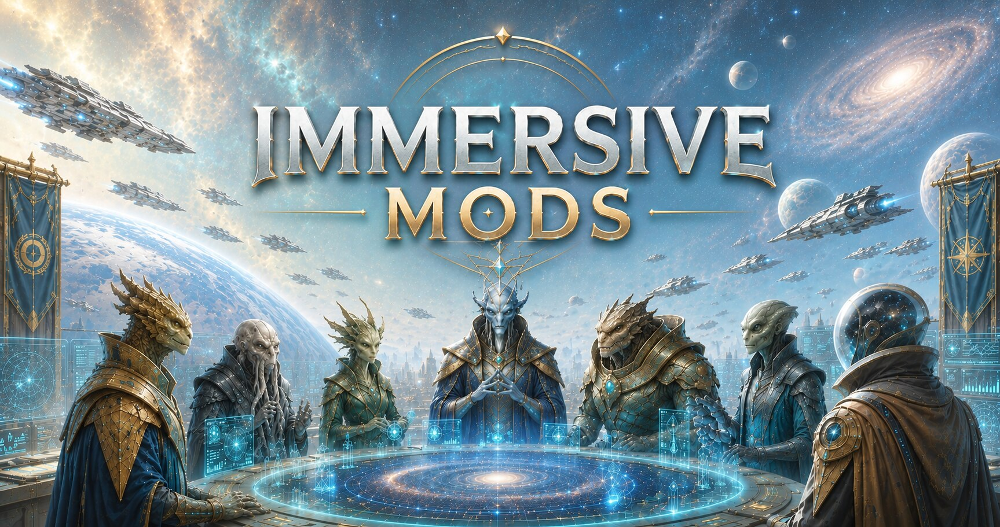

# Immersive Mods for Stellaris

A collection of Stellaris mods I develop and maintain.

Mods are kept up to date with the current game version.

**On Steam**
https://steamcommunity.com/sharedfiles/filedetails/?id=3733815669

## Mods and Repo Links

- [Ambient Civilization Lore Pack](https://github.com/non-npc/Stellaris-Mods-Collection/tree/master/AmbientCivilizationLorePack)
- [Bad Diplomacy](https://github.com/non-npc/Stellaris-Mods-Collection/tree/master/BadDiplomacy)
- [Battle Perks](https://github.com/non-npc/Stellaris-Mods-Collection/tree/master/BattlePerks)
- [Chatty Construction](https://github.com/non-npc/Stellaris-Mods-Collection/tree/master/ChattyConstruction)
- [Civilian Employment](https://github.com/non-npc/Stellaris-Mods-Collection/tree/master/CivilianEmployment)
- [Civilian Space](https://github.com/non-npc/Stellaris-Mods-Collection/tree/master/CivilianSpace)
- [Cosmic Casino](https://github.com/non-npc/Stellaris-Mods-Collection/tree/master/CosmicCasino)
- [Department of Strange Incidents](https://github.com/non-npc/Stellaris-Mods-Collection/tree/master/DSI)
- [Elemental Warfare](https://github.com/non-npc/Stellaris-Mods-Collection/tree/master/ElementalWarfare)
- [Exotic Weapons](https://github.com/non-npc/Stellaris-Mods-Collection/tree/master/ExoticWeapons)
- [Fateweaving](https://github.com/non-npc/Stellaris-Mods-Collection/tree/master/Fateweaving)
- [Galactic Rumors Lore Pack](https://github.com/non-npc/Stellaris-Mods-Collection/tree/master/GalacticRumorsLorePack)
- [Lucky Events](https://github.com/non-npc/Stellaris-Mods-Collection/tree/master/LuckyEvents)
- [Planetary Festivals](https://github.com/non-npc/Stellaris-Mods-Collection/tree/master/PlanetaryFestivals)
- [The Mostly Harmless Guide to the Galaxy](https://github.com/non-npc/Stellaris-Mods-Collection/tree/master/TheMostlyHarmlessGuide)
- [Unfortunate Events](https://github.com/non-npc/Stellaris-Mods-Collection/tree/master/UnfortunateEvents)
- [Viral News](https://github.com/non-npc/Stellaris-Mods-Collection/tree/master/ViralNews)
- [Viral Weapons](https://github.com/non-npc/Stellaris-Mods-Collection/tree/master/ViralWeapons)

## Open Source

All of my Stellaris mods are open source.

The complete source code, scripts, localisation files, assets, and project files can be found in the Stellaris Mods Collection repository:

https://github.com/non-npc/Stellaris-Mods-Collection

Feel free to examine the code, learn from it, modify it for personal use, or contribute improvements.

## Feedback and Contributions

Bug reports, suggestions, balance feedback, feature requests, localisation improvements, and general ideas are always welcome.

If you encounter an issue, please provide as much information as possible, including:

- Mod name
- Stellaris version
- Active mod list
- Error log entries (if available)
- Steps required to reproduce the issue

Constructive feedback helps improve future updates and makes the mods better for everyone.

## Localisation Support

Localisation fixes, corrections, and new language translations are greatly appreciated.

If you notice:

- Grammar issues
- Untranslated text
- Formatting problems
- Incorrect terminology
- Missing localisation entries

Please feel free to submit updates through the GitHub repository.

## Community Contributions

Community contributions are welcome. This includes:

- Bug fixes
- Compatibility updates
- Balance adjustments
- Localisation corrections
- New language translations
- Code improvements
- Content suggestions
- Documentation updates

## Mods and Repo links

**GitHub Repository**: https://github.com/non-npc/Stellaris-Mods-Collection

**Steam Mod Collection**: https://steamcommunity.com/sharedfiles/filedetails/?id=3733815669

---

Thank you for supporting these projects and helping improve the Stellaris modding community.
